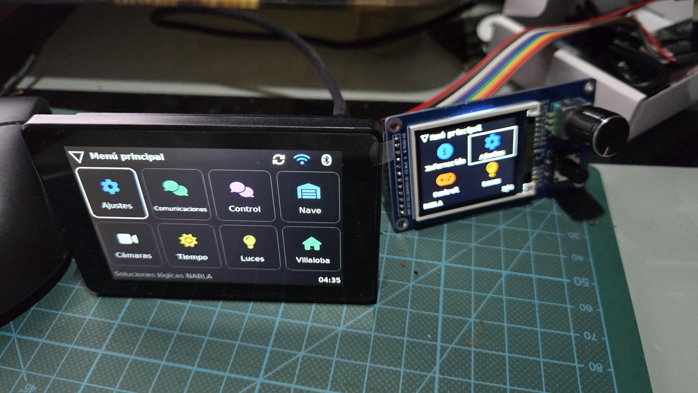

# ∇ nabla-esp-ui

**One UI library. Touch screens, rotary encoders and small displays.**

Build ESPHome panels with menus defined in YAML, reusable controls and a
consistent visual style. Use LVGL on larger screens or the compact display
renderer on smaller devices. Home Assistant and MQTT are optional integrations;
local navigation and settings do not depend on a server.

*Two real devices running Nabla ESP UI: JC3248W535CN touch panel on the left,
NodeMCU-32S with a 160×128 ST7735 display and encoder on the right.
The menus shown belong to a private installation; the reusable library is public.*

## Start here

- **Use the library:** [GitHub setup guide](docs/GITHUB-LIBRARY.md) and
  [editable device YAML](examples/github/panel.yaml).
- **Try it on your computer:** [simulator guide](simulator/README.md).
- **Choose hardware:** [touch panel](hardware/README.md) or
  [ST7735 encoder panel](hardware/nodemcu-32s-st7735.md).
- **Follow development:** [platform plan](docs/platform/README.md) and
  [milestones](docs/platform/ROADMAP.md).

Import packages/regular.yaml for LVGL or packages/compact.yaml for the compact
renderer. Pin a tested Git commit. Your device YAML owns its menus, hardware,
network configuration and bindings; GitHub supplies the reusable components,
fonts and assets. Nothing needs to be downloaded by the device at startup.

## What you can build

- Nested menus with tiles, lists, scrolling, focus and reachable Back controls.
- Large touch layouts, compact four-icon launchers and readable single-item views.
- Touch, keyboard and a deployed GPIO encoder/push/K0 composition.
- Dark/light themes, Ubuntu Mono or DejaVu Sans, color icons and borderless focus.
- Live device information: model, Wi-Fi, IP, router, signal, version and uptime.
- Light controls through optional [Home Assistant](adapters/ha-lights/README.md)
  and [MQTT adapters](adapters/mqtt-lights/README.md), with explicit availability
  and a confirmation step for compact brightness changes.
- Camera previews backed by an optional [Home Assistant image cache](services/homeassistant/README.md):
  shared, on-demand 64×64 thumbnails and JPEGs up to 480 pixels.
- Wi-Fi provisioning through an optional [primary Wi-Fi adapter](external_components/nabla_wifi/README.md)
  or [captive portal](external_components/captive_portal/README.md) fetched from GitHub.
- Shared text/password, numeric, choice and toggle form prototypes with
  cancel/confirm behavior.

The bundled desktop is an example catalog, not a complete application suite.
Its Wi-Fi forms and some status indicators are simulations unless an actual
adapter is configured. Compact Wi-Fi/form prototypes still target 128×64;
the ST7735 deployment uses the captive portal for network provisioning.

## Current status

**Active development, pre-1.0.** Tested baseline: ESPHome 2026.8.2;
the regular renderer uses LVGL 9.5.

- **JC3248W535CN:** physical launcher and touch navigation confirmed; initial
  primary Wi-Fi scan/save/rollback checks passed.
- **NodeMCU-32S / ST7735:** 160×128 color launcher photographed on hardware;
  OTA installation, encrypted API reconnection and live MQTT reception verified.
  Build resource figures and remaining checks are in the
  [target notes](hardware/nodemcu-32s-st7735.md).
- **Host profiles:** 480×320 regular, 320×480 portrait, 160×128 compact color
  and 128×64 tiny/readable.

M1 adaptive profiles and M2 local forms have a host baseline. M3 remains open:
physical usability, recovery and prolonged reconnect/navigation testing are not
complete. Physical OLED validation, generalized joystick/input adapters, BLE
cooperation, Nabla Edge integration and vehicle telemetry remain planned.
A working demonstration is not a completed hardware qualification.

## How it fits together

- **Device YAML:** application tree, hardware, private bindings and secrets.
- **packages/, components/, profiles/:** reusable composition, presentation and editors.
- **navigation/ and external_components/:** navigation contracts, code generation and adapters.
- **theme/, locales/, assets/:** visual style, translations and licensed assets.
- **simulator/ and tests/:** development fixtures and regression checks.
- **docs/platform/:** architecture, proposed capabilities and completion gates.

ESPHome packages assemble the firmware; navigation validation happens during
normal ESPHome compilation. There is no mandatory standalone generation step.
See the [component catalog](components/README.md) and
[navigation contract](navigation/README.md).

## Design principles

Keep application meaning separate from screen layout and transport. A small
screen needs a readable layout, not a shrunken desktop. Touch actions need an
equivalent path through sequential input and Back.

Represent unknown, stale and unavailable data explicitly. Keep network work
bounded and the UI responsive. Add capabilities as documented modules with
examples and measured evidence.

A small encoder device may eventually control a larger panel, and a larger
panel may provide a keyboard for a smaller one. Those peer roles are a design
goal, not a released BLE feature.

## Your installation stays yours

Keep network credentials, tokens, device YAML and camera/entity bindings outside
the public repository. Public examples use synthetic data. Read the
[public/private boundary](docs/PRIVATE-INSTALLATIONS.md) before sharing a configuration.

The hardware photo above was provided by the project owner for publication.
It illustrates a private composition; it does not distribute its configuration.

## Contributing

Start with [AGENTS.md](AGENTS.md), the [architecture](docs/ARCHITECTURE.md) and
[brand guidelines](docs/BRAND.md). Documentation and identifiers use English;
the UI supports Spanish and English.

Preserve bundled font licenses and upstream component notices. In particular,
the optional captive portal retains ESPHome and webserver licensing.

## References

- [ESPHome LVGL](https://esphome.io/components/lvgl/)
- [ESPHome packages](https://esphome.io/components/packages/)
- [SDL host display](https://esphome.io/components/display/sdl/)
- [ESPHome UI Kit](https://github.com/mplogas/esphome-ui-kit)
- [ESPHome Modular LVGL Buttons](https://github.com/agillis/esphome-modular-lvgl-buttons)

External projects are references, not claims of API compatibility.
