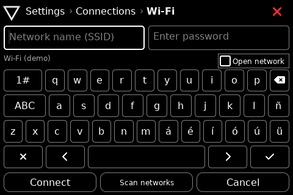
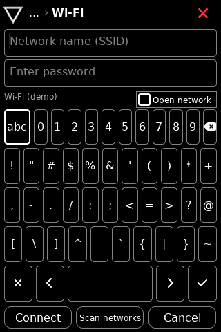
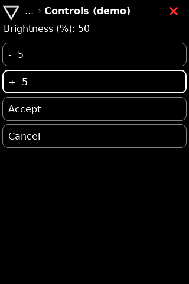
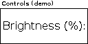

# M2 host verification

M2 supplies a complete local forms vertical slice on the host. M0, M1 and M2
are host/documentation milestones; no ESP32 board or OLED hardware was validated.

## Reproduce

From the repository root, activate .venv and run:

    python3 -m unittest discover -s tests -p 'test_*.py'
    esphome compile simulator/hello-world.yaml
    esphome compile simulator/portrait.yaml
    esphome compile simulator/compact.yaml
    esphome compile simulator/readable.yaml

Repeat each build with esphome -s ui_language en compile <configuration>.
The native stock fallback uses -s nabla_keyboard_latin false.
The independent simulator/password.yaml fixture also compiles and disables
last-character password disclosure. Dependencies remain pinned in requirements.txt.

Ten unittest cases pass. C++ form transaction tests additionally use AddressSanitizer
and UndefinedBehaviorSanitizer. Tests cover:
- Invalid schema types, unknown fields, duplicate choices/keys, int32 limits,
  invalid defaults/steps and generated descriptor escaping.
- Equivalent touch-style and sequential actions; field cancel, whole-form cancel,
  default-safe confirmation, invalid save, retained values and single commit.
- Choice focus restoration, directional adjustment and saturation without overflow.
- UTF-8 byte boundaries, malformed sequences, NUL/surrogate rejection and deletion.
- Empty/error/normal scans, duplicate grouping, open/protected distinction and
  the exact 32-byte SSID boundary.
- Failure/retry, cancellation before completion, repeated submit, snapshot
  isolation and timer wraparound.
- Existing catalog, profile geometry, nested routes, focus and scrolling regressions.

## Visual and input checks

Independent SDL windows were used so the main interactive demo was not the
source of test state. These checks complement model tests; they are not an
automated pixel-diff suite.

Regular 480x320 and portrait 320x480:
- Enter Settings > Connections > Wi-Fi with Up/Down/Enter.
- Touch an accented key and press Enter: the same key repeats because touch
  also updates semantic focus. The password remains masked.
- Normal/empty/error scans display the corresponding state. The result list
  scrolls to long and duplicate names; Back is reachable.
- Selecting an open fixture connects in the mock and clears the password.
- Edit a number, accept its draft, confirm Save and inspect the saved state.
- Escape restores field/dialog focus; Cancel does not commit.
- Inspect English labels, portrait punctuation keyboard and light inversion.

Native 128x64 tiny and readable:
- The same form metadata becomes a three-row or single-large-row list.
- Edit and cancel through Up/Down/Enter, re-enter and inspect the unchanged value.
- Normal scan, open selection and Connect complete without a touchscreen.
- Selected long labels have a one-second initial dwell before scrolling.
- Numeric edit reserves room for the value even when the label is long.
- The light/dark frames contain only black and white. The browse font is 10 px
  for tiny, 16 px for readable; compact titles remain 8 px.

Screens below show actual host output, not design mockups.

## Completion boundary

Text/password, bounded numeric editing, choice, toggle, validation and confirmation
are implemented as documented in [forms](../../components/forms/README.md).
The gallery is configured through accepted nabla_navigation.forms metadata and
the forms_demo route. Wi-Fi uses the separate wifi_demo route.

M2 does not establish persistent writes, real credential acceptance, physical
input debounce, hardware latency/legibility, radio recovery, BLE provisioning,
Home Assistant or Nabla Edge interoperability. Those remain their named roadmap
milestones. Raw PSKs, enterprise Wi-Fi, general IMEs, arbitrary named forms,
date/time pickers and other components outside this vertical slice are not
implicitly supported.

The Wi-Fi accepted/revision counters are local mock lifecycle guards, not a
transport protocol. The [adapter extension contract](../../components/forms/README.md#extending-beyond-the-mock)
defines the responsibilities that real M3 networking must preserve.
