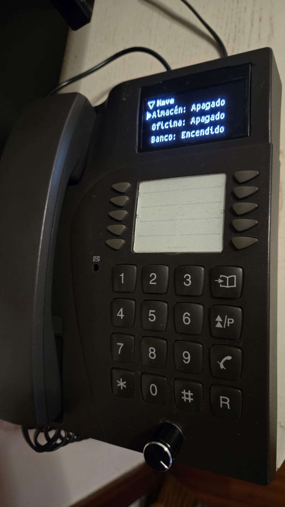

# LILYGO T-Call + SSD1309 OLED + encoder

This assembly combines an ESP32 T-Call board, an external 2.42-inch monochrome
128×64 SPI OLED identified as SSD1309, and a rotary encoder. The OLED is driven
through ESPHome's ssd1306_spi / SSD1306_128X64 configuration. It is not an
integrated T-Watch display. Confirm the exact board/module revision before reuse.

*Owner-provided photograph, published with permission on 2026-09-19.
The display shows the private installation's light list and reported states.
The photo documents physical presentation; it does not independently establish
that each load was actuated. Private bindings are not distributed.*

## Public composition

- [Complete bring-up YAML](../devices/tcall-ssd1309.yaml).
- [Hardware package](tcall-ssd1309.yaml).
- [Profile](../profiles/tcall128.yaml).
- [Host preview](../simulator/tcall.yaml) and [menu notes](../examples/tcall/README.md).

The public firmware uses synthetic light actions and mock Wi-Fi. It needs no
installation secrets. The private deployed composition instead supplies real
MQTT bindings, Wi-Fi fallbacks, encrypted API, OTA and nabla_wifi_compact.
Do not flash the public bring-up fixture over a networked installation expecting
to retain OTA: it deliberately contains no network credentials or OTA service.

## Wiring and interaction

- SPI: clock GPIO18, MOSI GPIO23; OLED CS GPIO33, DC GPIO32, reset GPIO25.
- Display driver rotation: 180 degrees; logical resolution remains 128×64.
- Encoder A GPIO14, B GPIO13; clockwise moves up, anticlockwise moves down.
- Push GPIO19, active low, internal pull-up and 20 ms debounce.
- Short click selects; long click (800 ms to 5 s) returns when released.
- The modem is disabled; avoid repurposing its pins without a separate review.

The profile uses a 13 px header, 11 px header font and three 17 px rows with a
12 px body font. The root title was tuned to 12 px bold. Root presentation can
switch between a text list and animated single-icon view. Wi-Fi and menus share
the logo; the encoder can reach Back in the Wi-Fi flow and password editor.

## Evidence recorded on 2026-09-19

The private firmware 0.7.0-ui, using library revision
8d8b42919936cf0351922fc709303da13d0bab08, compiled and installed successfully
over authenticated OTA. The device reconnected through encrypted API and
reported that exact project version. The owner confirmed the result works
and approved its overall appearance on the physical assembly.

Build figures for that private firmware: 1,147,703-byte application (62.5% of
its application partition), 60,708 bytes static RAM (33.6% of the reported
180,736-byte budget). Static RAM is not a runtime heap measurement.

Host checks cover navigation wrap, view switching, password draft cancellation,
palette switching and masked rendering. The five private MQTT commands retain
their existing topics; individual load actuation was not independently verified
during this deployment. Real Wi-Fi credential replacement, rollback under failure,
power-cycle recovery and prolonged soak still need recorded physical tests.

The photograph above accompanies the owner-confirmed operation. This evidence
applies to this wired assembly, not every T-Call variant or every OLED panel.

## Build and recovery

From the repository root, activate the pinned ESPHome environment and run:

    esphome compile devices/tcall-ssd1309.yaml

Preserve private YAML, credentials and a recoverable firmware before upgrades.
The prior Device Builder YAML was backed up before replacing it; that is a
configuration backup, not proof of a full flash backup. Public source revisions
are pinned in the private Builder configuration.
